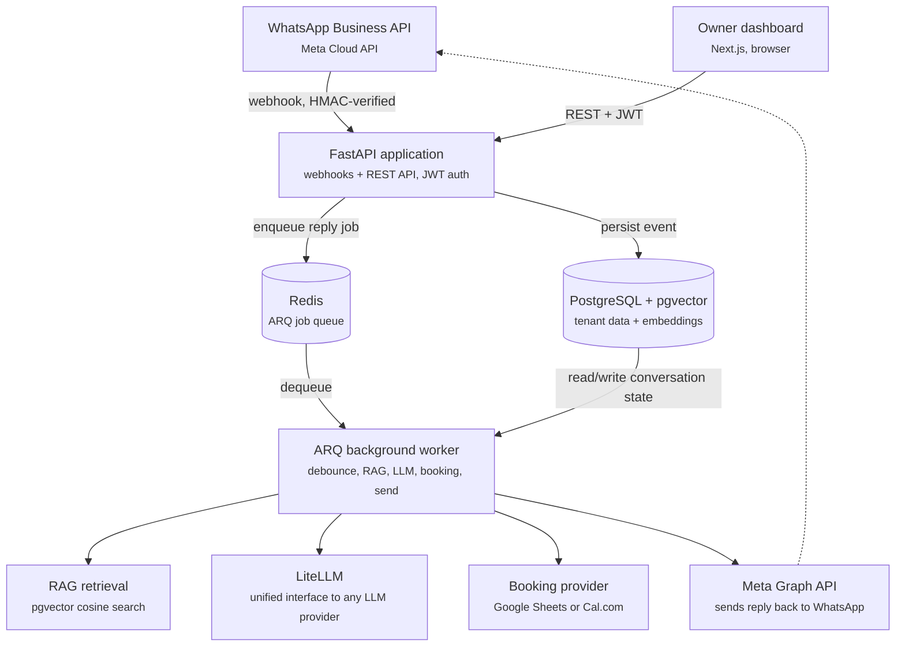
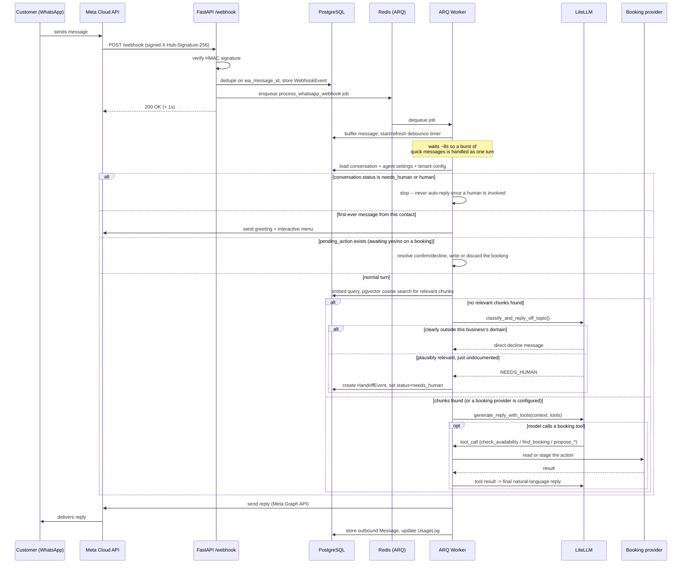
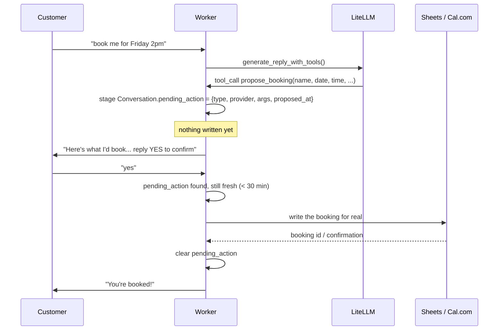
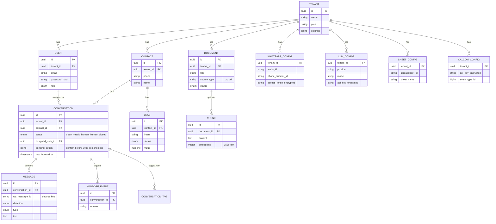
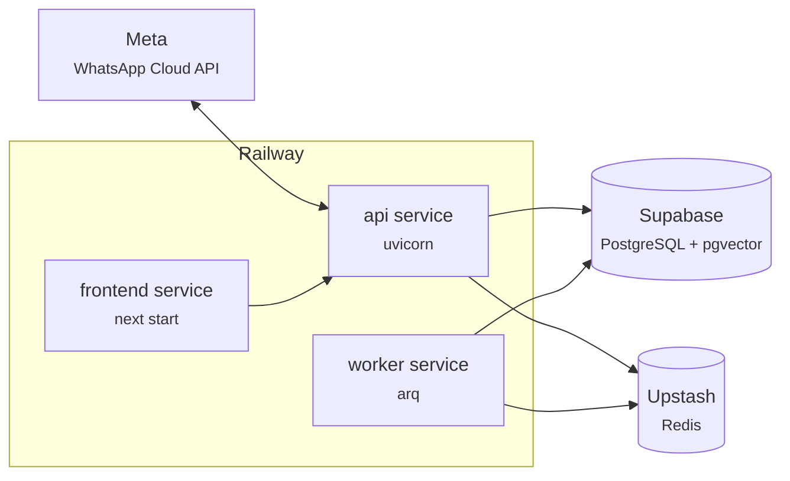

# System Architecture

A professional, from-first-principles overview of the WhatsApp AI Receptionist
platform: what it is, how the pieces fit together, how a message actually
flows through the system, the data model, and where everything lives in the
repo. Written to be read top-to-bottom by an engineer who has never seen the
codebase.

---

## 1. What this system is

A multi-tenant SaaS backend + dashboard that lets a business connect its
WhatsApp Business number to an AI assistant. The assistant answers customer
questions grounded in documents the business uploads (RAG), captures leads,
hands off to a human when it's out of its depth, and can read/write real
appointment bookings (Google Sheets or Cal.com). Every table, query, and
background job is scoped to a `tenant_id` — one deployment serves many
independent businesses, each with their own WhatsApp number, knowledge base,
LLM key, and booking backend.

Three runtime processes, two managed cloud data stores, and one external
platform (Meta) make up the whole system:

| Process | Framework | Responsibility |
|---|---|---|
| **API** | FastAPI (async) | Webhook intake, REST API for the dashboard, auth |
| **Worker** | ARQ | Everything slow: RAG, LLM calls, booking writes, sends |
| **Frontend** | Next.js 14 (App Router) | Owner-facing dashboard |

| Data store | Hosted on | Holds |
|---|---|---|
| PostgreSQL 16 + pgvector | Supabase | All relational data + document embeddings |
| Redis | Upstash | ARQ job queue + short-lived debounce buffers |

---

## 2. System architecture



**Why a worker exists at all:** the webhook handler must return to Meta in
under a second or Meta starts retrying/backing off the connection. Everything
that actually takes time — embedding a query, calling an LLM, hitting a
booking provider's API, sending the reply — happens off the request path, in
ARQ, after the webhook has already returned `200 OK`.

---

## 3. End-to-end message flow

What happens between a customer typing "hi" on WhatsApp and receiving a reply.



Key rules baked into this flow, not just conventions:

- **Handoff is sacred.** Once a conversation is `needs_human` or `human`, the
  worker never generates another automatic reply — a human must resolve it.
- **24-hour service window.** Outbound sends are only attempted within
  WhatsApp's 24h customer-service window; template messages are the planned
  path for anything outside it (see §8).
- **Debounce, not per-message replies.** A customer sending three quick
  messages in a row gets one reply to all three, not three separate replies —
  a Redis-backed buffer + generation counter coalesces them.
- **Off-topic ≠ handoff.** A question genuinely outside the business's domain
  (asking an eye clinic about knee pain) gets a direct, honest decline — no
  human is paged. A question that's plausibly this business's territory but
  undocumented still escalates to a human.

---

## 4. Booking: confirm-before-write

The one place the assistant is allowed to change real-world state (create or
move an appointment), so it gets an explicit safety gate: propose, wait for
an explicit "yes", only then write.



If the reply is "no", or the pending action is older than
`PENDING_ACTION_TTL_MINUTES` (30), or the next message isn't a clear yes/no,
nothing is written — the pending action is cleared and the message falls
through to the normal pipeline instead. This is provider-agnostic: the same
gate handles both Google Sheets (phone-keyed, service-account read/write) and
Cal.com (email-keyed, API-key based) — the routing lives in
`_execute_booking_tool()` / `_handle_pending_action_reply()` in
`app/worker/jobs.py`, branching on a `provider` field stored right on the
pending action.

---

## 5. Data model



Every table except `Tenant` and `WebhookEvent` (which needs to accept events
before a tenant is even resolved) inherits `TenantScopedMixin` — a
`tenant_id` column that every query must filter on. This is the single most
important invariant in the codebase: a query missing a `tenant_id` filter is
a cross-tenant data leak, not a style issue. `tests/test_tenant_isolation.py`
exists specifically to catch regressions here.

Secrets (`access_token_encrypted`, `api_key_encrypted`) are Fernet-encrypted
at rest with a server-side key (`FERNET_KEY`), never stored plaintext, and
only ever decrypted in-memory right before use.

---

## 6. Security model

- **Webhook authenticity** — every inbound Meta webhook is verified against
  `X-Hub-Signature-256` using `META_APP_SECRET` before anything else happens;
  an unconfigured secret hard-503s rather than silently accepting
  unauthenticated traffic.
- **Dedup** — Meta retries webhook delivery; every event is deduped on
  `wa_message_id` before processing, so retries never double-reply.
- **Auth** — dashboard auth is JWT (`python-jose`), `tenant_id` is read from
  the verified token server-side, never trusted from the request body.
- **Secrets at rest** — WhatsApp access tokens, LLM API keys, and Cal.com/
  Sheets credentials are Fernet-encrypted per row.
- **Tenant isolation** — enforced at the query layer via
  `TenantScopedMixin` + `TenantId` dependency, not just at the API boundary.

---

## 7. Repository structure

```
whatsapp-ai-receptionist/
├── app/                          Backend (FastAPI + ARQ), Python 3.11
│   ├── main.py                   FastAPI app, router wiring, CORS, /health
│   ├── core/
│   │   ├── config.py             Settings (env-driven, pydantic-settings)
│   │   ├── deps.py               DbSession / TenantId / CurrentUser DI
│   │   └── security.py           JWT, password hashing, Fernet encrypt/decrypt
│   ├── db/
│   │   ├── base.py                Declarative base + mixins (Tenant-scoped, timestamps)
│   │   └── session.py             Async session factory (Supavisor pooler, NullPool)
│   ├── models/                    SQLAlchemy 2.0 ORM models (one file per table)
│   │   ├── tenant.py, user.py, contact.py, conversation.py, message.py
│   │   ├── document.py, chunk.py            RAG source docs + embedded chunks
│   │   ├── lead.py, handoff_event.py, conversation_tag.py, audit_log.py
│   │   ├── usage_log.py                     per-tenant usage/cost tracking
│   │   ├── whatsapp_config.py, llm_config.py, sheet_config.py, calcom_config.py
│   │   └── webhook_event.py                 raw inbound events + diagnostics
│   ├── schemas/                   Pydantic v2 request/response shapes
│   ├── routers/                   REST endpoints (mounted in main.py)
│   │   ├── auth.py                 signup/login, JWT issuance
│   │   ├── webhook.py               Meta webhook verify (GET) + receive (POST)
│   │   ├── documents.py             knowledge base CRUD + PDF upload
│   │   ├── settings.py              WhatsApp/LLM/Sheets/Cal.com/agent config
│   │   └── conversations.py         conversation list/detail, CRM fields, leads
│   ├── services/                  Business logic, no HTTP framework code
│   │   ├── llm.py                   LiteLLM wrapper: generate_reply,
│   │   │                            generate_reply_with_tools, off-topic classifier,
│   │   │                            BOOKING_TOOLS definitions, embeddings, Whisper
│   │   ├── rag.py                   chunk, embed, ingest, retrieve (pgvector)
│   │   ├── meta.py                  WhatsApp Cloud API client (text, audio,
│   │   │                            interactive list messages)
│   │   ├── sheets.py                 Google Sheets client (service-account JWT)
│   │   ├── calcom.py                 Cal.com API v2 client (API-key based)
│   │   ├── pdf_extract.py            pypdf text extraction for PDF uploads
│   │   ├── conversations.py          conversation/lead helper queries
│   │   ├── agent_settings.py         per-tenant reply-mode/tone/greeting config
│   │   └── notifications.py          owner email notification on handoff
│   └── worker/
│       ├── worker_settings.py       ARQ WorkerSettings (Redis conn, cron, timeouts)
│       ├── queue.py                  enqueue_job() helper used by the API
│       └── jobs.py                   the whole pipeline: process_whatsapp_webhook,
│                                      debounce, greeting, RAG+LLM reply generation,
│                                      off-topic gate, handoff, booking tool execution
├── migrations/                    Alembic, one file per schema change
│   └── versions/0001..0006        initial schema → CRM fields → Sheets → Cal.com
├── tests/                         pytest + pytest-asyncio, real Postgres+pgvector
│   └── conftest.py                 FakeRedis test double (deferred jobs run inline)
├── scripts/
│   └── seed_dev_tenant.py         creates a local dev tenant + sample data
├── frontend/                      Next.js 14 (App Router) + Tailwind + shadcn/ui
│   └── src/
│       ├── app/
│       │   ├── login/, signup/                 auth pages
│       │   └── dashboard/
│       │       ├── page.tsx                     overview (live conversations/leads)
│       │       ├── conversations/               split-pane inbox + CRM panel
│       │       ├── knowledge/                   document upload (text + PDF)
│       │       ├── settings/                    agent behavior, greeting/menu
│       │       ├── integrations/                WhatsApp, Sheets, Cal.com, Calendar
│       │       └── status/                      connection/webhook diagnostics
│       ├── components/ui/                       shadcn/ui primitives (M3-styled)
│       └── lib/
│           ├── api.ts                            fetch wrapper (JWT, timeout, postFile)
│           ├── auth-context.tsx                  client-side auth state
│           └── types.ts                          API response types, kept in sync by hand
├── Dockerfile                    api/worker image (uvicorn, shell-form $PORT)
├── frontend/Dockerfile            frontend image (multi-stage, build-time API URL)
├── docs/
│   ├── ARCHITECTURE.md            this file
│   └── MESSAGE_FLOW_AND_INTEGRATIONS.md   integration build order, message flow detail
├── CLAUDE.md / AGENTS.md          agent operating rules for this repo
├── DESIGN.md                      frontend design system (M3 tokens)
└── WHATSAPP_AI_RECEPTIONIST_DOCS.md   original product spec (v1 scope)
```

**Where to look for X:**

| Question | File |
|---|---|
| How is a tenant's data isolated? | `app/db/base.py` (`TenantScopedMixin`), `app/core/deps.py` (`TenantId`) |
| How does a webhook get verified? | `app/routers/webhook.py` |
| What actually generates a reply? | `app/worker/jobs.py::_generate_and_send_reply` |
| How does RAG retrieval work? | `app/services/rag.py` |
| How does tool-calling (booking) work? | `app/services/llm.py::generate_reply_with_tools`, `app/worker/jobs.py::_execute_booking_tool` |
| How is a secret encrypted? | `app/core/security.py` (Fernet) |
| What does the dashboard call? | `frontend/src/lib/api.ts` + `app/routers/*.py` |
| What's configurable per tenant? | `app/services/agent_settings.py` |

---

## 8. Deployment



Three Railway services share one repo (same root Dockerfile for api/worker,
`frontend/Dockerfile` for the dashboard), Postgres and Redis stay on their
managed providers. This replaced an earlier local-tunnel setup (Cloudflare
quick tunnel) that generated a new URL on every restart — Meta needs a
*stable* HTTPS URL for webhook delivery, which a real deployment provides.

---

## 9. What's next (as of this doc)

- **Cal.com** — backend provider-routing and dashboard settings card are
  built; live verification against a real Cal.com API key is pending.
- **WhatsApp template messages + scheduled reminders** — approved-template
  sending (for outbound messages outside the 24h window, e.g. "your
  appointment is tomorrow") — not yet built.
- **Google Calendar OAuth** — deliberately last in the booking-provider
  build order (per-user consent flow, distinct from Sheets' service-account
  model and Cal.com's API-key model).
- **Production hardening** — rate limiting, error tracking (Sentry),
  structured log aggregation, DB backups are identified but not yet done.

See `docs/MESSAGE_FLOW_AND_INTEGRATIONS.md` for the detailed reasoning behind
the integration build order.
